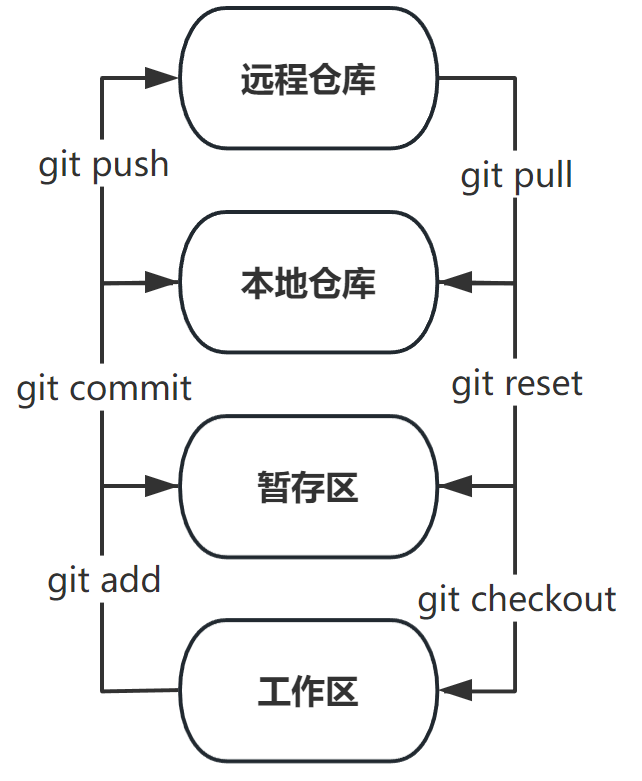

##**Git的工作原理**
>**索引**
- [Git工作区域](#area)
- [Git工作区域关系图](#rela)
- [Git中文件的四种状态](#sta)
>**
Git工作区域
**

- **工作区/工作目录(workspace/working directory)**：就是能在电脑里看到的目录。
- **暂存区/索引(stage/index)**: 一般存放在 .git 目录下的 index 文件（.git/index）中。
- **版本库-本地仓库(repository)**：工作区有一个隐藏目录 .git，这个是 Git 的版本库，其中*Head*指向最新放入库的版本。
- **版本库-远程仓库(remote direcory)**：存储网络上的版本库。类似网盘的作用。如 [github](https://github.com/ "国际的网站") , [gitee/码云](https://gitee.com/ "国内的网站") 等等。
  
>**
Git工作区域关系图
**

  

>**
Git中文件的四种状态
**

- **Untracked**: 未跟踪, 此文件在文件夹中, 但并没有加入到git库, 不参与版本控制. 通过git add 状态变为Staged.

- **Unmodify**: 文件已经入库, 未修改, 即版本库中的文件快照内容与文件夹中完全一致. 这种类型的文件有两种去处, 如果它被修改, 而变为Modified. 如果使用git rm移出版本库, 则成为Untracked文件

- **Modified**: 文件已修改, 仅仅是修改, 并没有进行其他的操作. 这个文件也有两个去处, 通过git add可进入暂存staged状态, 使用git checkout 则丢弃修改过, 返回到unmodify状态, 这个git checkout即从库中取出文件, 覆盖当前修改

- **Staged**: 暂存状态. 执行git commit则将修改同步到库中, 这时库中的文件和本地文件又变为一致, 文件为Unmodify状态. 执行git reset HEAD filename取消暂存, 文件状态为Modified。